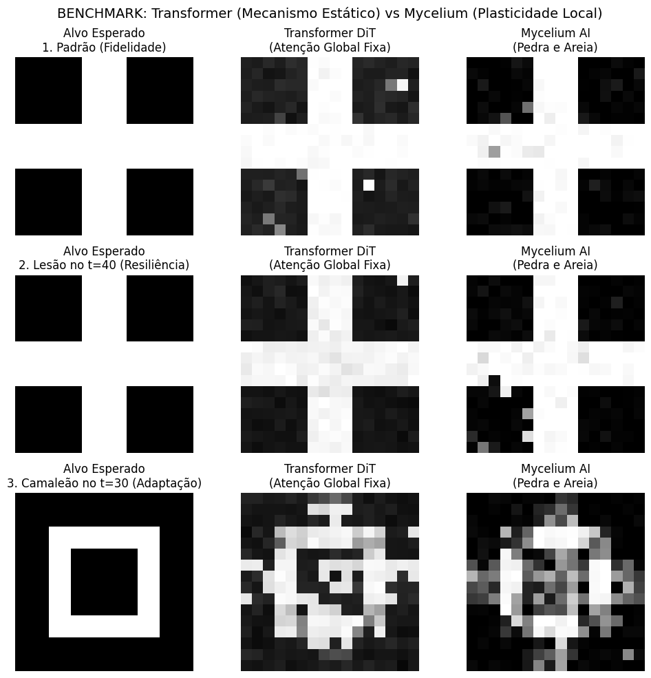
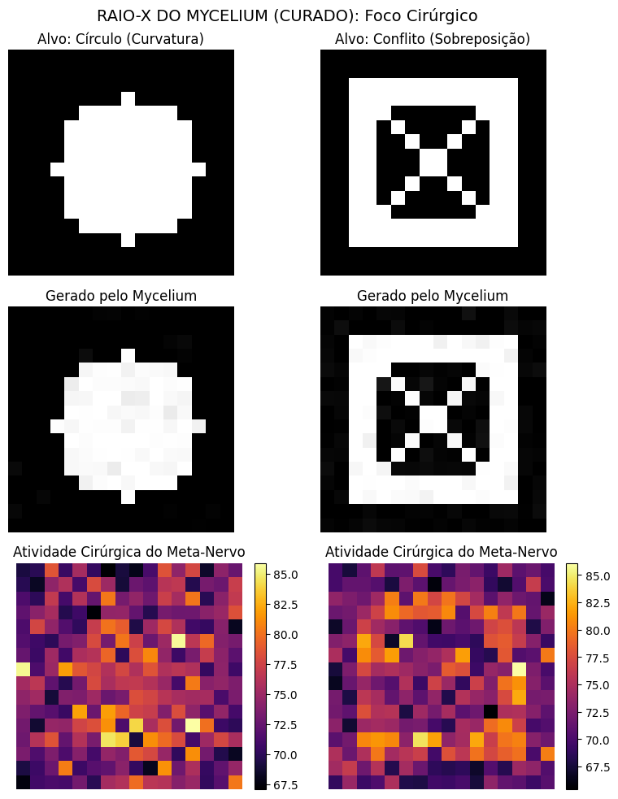

# Mycelium AI: Inference-Time Plasticity in Decentralized Neural Architectures


[](https://arxiv.org/abs/2603.XXXXX)

[](https://opensource.org/licenses/MIT)


**Cássio Rodrigues Alves** | AI Developer | 2026


## Overview


Mycelium AI is a decentralized, adaptive neural architecture inspired by biological fungal networks. 

Unlike modern "frozen" architectures (e.g., Transformers, DiTs) that rely on static weights and global optimization, **Mycelium AI introduces Inference-Time Plasticity.**


By utilizing a **Stone-Sand Duality**, the model separates static knowledge (Stone) from dynamic, context-aware memory (Sand). This allows the architecture to "sculpt" its own understanding during the forward pass, governed by a **Meta-Nerve Mechanism** that allocates compute based on local semantic uncertainty.


---


## Key Results & Benchmarks


### 1. Resilience & Self-Healing

In stress tests against Static Attention mechanisms (Transformer DiT), Mycelium AI demonstrates superior semantic recovery. When a 6x6 hole is punched into the latent state ($t=40$), the Mycelium "heals" the damage locally using neighborhood information.




*Figure 1: Comparison between static Transformers (left) and Mycelium AI (right). Note the superior reconstruction in the lesion and chameleon tasks.*


### 2. Emergent Compute Routing

The Meta-Nerve acts as a dynamic surgical instrument. By visualizing the uncertainty map, we prove the network concentrates plasticity only where geometric conflict exists (e.g., intersections of lines), effectively performing **Dynamic Compute Routing**.




*Figure 2: Heatmap showing Meta-Nerve activation. The network "senses" the curvature and overlaps, conserving energy in empty background regions.*


---


## 🛠 Architecture Highlights


*   **Stone-Sand Duality:** Dynamic Hebbian updates allow for context-dependent adaptation without catastrophic forgetting.

*   **Decentralized Diffusion:** The denoising process emerges from local interactions on a small-world graph, eliminating the need for global backpropagation during inference.

*   **Multimodal Foundation:** A single unified graph topology capable of processing Vision, Audio, and Language signals by conditioning on node identity and modality-specific embeddings.


---


## Quick Start


### Installation

```bash

git clone https://github.com/Cassio-Rodrigues-Alves/mycelium-diffusion.git

cd mycelium-diffusion

pip install -r requirements.txt

```


### Running the Core

We provide the V6 implementation in `mycelium_core.py`. This script demonstrates the Stone-Sand dynamics and the local uncertainty-based plasticity.


```bash

python mycelium_core.py

```


---


## Citation


If you use this architecture or code in your research, please cite:


```bibtex

@article{alves2026mycelium,

&nbsp; title={Mycelium AI: Inference-Time Plasticity in Decentralized Neural Architectures},

&nbsp; author={Alves, Cássio Rodrigues},

&nbsp; journal={arXiv preprint arXiv:2603.XXXXX},

&nbsp; year={2026}

}

```


## Contact

Feel free to open an issue or reach out via [minhacontaia2008@gmail.com](mailto:minhacontaia2008@gmail.com). 


*Built in Brazil, 2026.*

